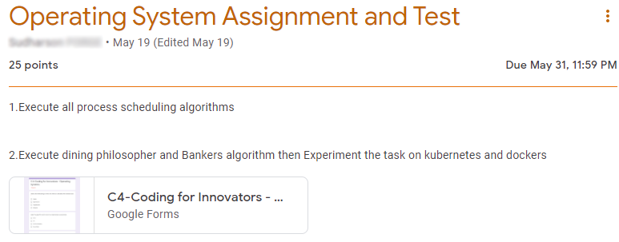

# ProtoSem OS Assignment

This is an assignment submission that implements several process scheduling algorithms (with pre-filled sample data) via a simple RESTful API (didn't see a better way to make it accessible from a container) and also runs it on docker and kubernetes.

### Assignment prompt

A copy of the original assignment prompt


## Getting Started

### Running the app locally

To run the app, simply clone the repo and run `pip install requirements.txt` and then run `python main.py`

### Building and running on docker

This project includes a Dockerfile to build and run your project on docker.

1. Clone the repo and build the container using ```docker build . -t protosem-os-assignment:latest```
2. Run the container using ```docker run -d -p 5001:5001 protosem-os-assignment```
3. Visit [localhost port 5001](http://localhost:5001) to view the app. (we assume you're running locally)

### Deploying to k8s

Since this is a *tiny* application, we're going to simply run and deploy to k8s locally via [minikube](https://minikube.sigs.k8s.io/docs/); to demonstrate for the purposes of this assignment.

> Note:
> If you are pulling your image from a hosted registry such as docker hub, skip *Step 3* and remove the `image-pull-policy` flag from *Step 4*

1. Install and start minikube by following steps 1 through 3 of [this guide](https://minikube.sigs.k8s.io/docs/start/).
2. Set env variables to reuse the Docker daemon from Minikube by running the appropriate command for your environment:
```
eval $(minikube docker-env)               # unix shells
minikube docker-env | Invoke-Expression   # PowerShell
```
3. Clone the repo and build the container using ```docker build . -t --rm protosem-os-assignment:latest``` if you don't already have it.
4. Run your container as a k8s pod by running `kubectl run ps-os-k8s --image=protosem-os-assignment:latest --image-pull-policy=Never`
5. Check that your pod is running using `kubectl get pods`
6. Forward a local port to the k8s pod running the application to make it accessible: `kubectl port-forward ps-os-k8s 8080:5001`
7. Visit [localhost port 8080](http://localhost:8080) to view the app.

## File Structure

This is a very small app that really doesn't need a file structure documentation. It's pretty obvious.
But for the sake of it, the important things to know are that: 

1. Algorithm implementations are included in the [algorithms folder](algorithms)
2. Proof of execution (screens) is included in [screenshots](SCREENSHOTS.md)
