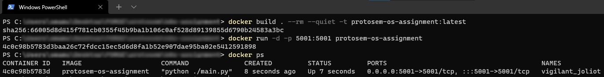

# Screenshots/Proof of Work

This page has screenshots/gifs of the tasks being completed/executed to show "proof of execution" as a requirement for the submission of this assignment.

## K8S deployment screenshot

The application is built as a docker image and deployed as a minikube k8s pod.

## Docker build and run screenshots

The application is built and run as a docker container.

## App running gif

This gif demonstrates the app running and shows the commands being executed as we move from the documentation page and open the GET endpoint in the browser.

